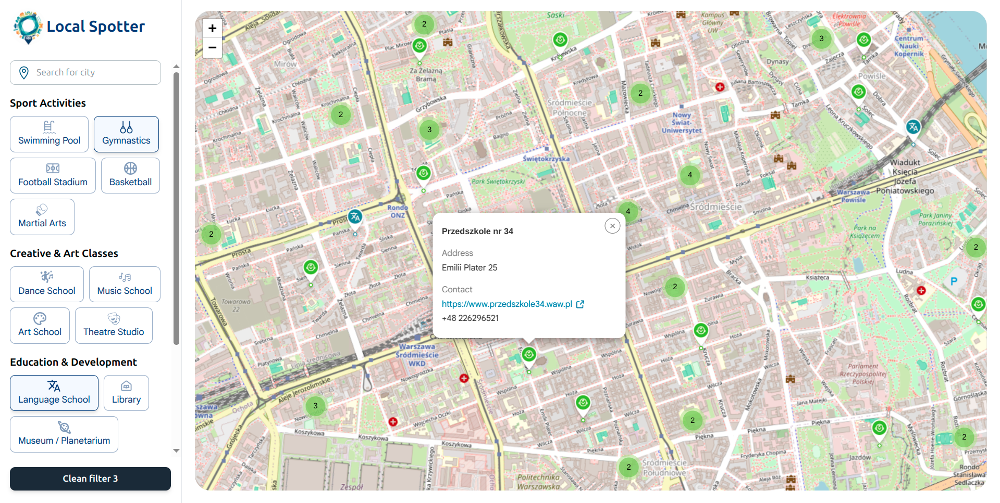
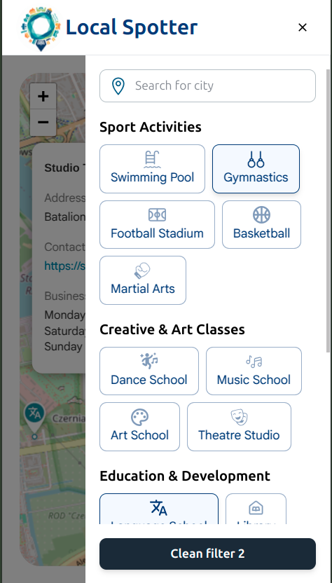

# 🗺️ Local Spotter
 
> Find sports clubs, art schools, libraries and more on an interactive map.
> Built for parents who want to explore what a neighbourhood has to offer their kids.
 
**[Live Demo →](https://y-v-h.github.io/)**
 

 
---
 
## 🚀 What it does
 
Local Spotter helps users find places nearby — sports facilities, art schools, libraries, coworking spaces and more — by filtering categories on an interactive map.
 
Key features:
- **20+ categories** across Sport, Creative, Education and Infrastructure
- **Click on any marker** to see address, phone, website and wheelchair accessibility
- **Cluster view** — markers group automatically at lower zoom levels
- **Multi-config build** — the project supports multiple regional deployments 
  via separate build scripts (`npm run build:pl` / `npm run build:by`). 
  Currently live version is configured for Poland.
- **OSM mirror fallback** — requests automatically retry across 3 mirrors; user sees an error only when all mirrors are unavailable
- **Responsive** — works on desktop and mobile
---
 
## 🛠️ Tech Stack
 
| Layer | Technology |
|---|---|
| Framework | React + TypeScript |
| Style | Tailwind CSS |
| State management | Zustand |
| Map | Leaflet + OpenStreetMap |
| Geocoding | Photon |
| Clustering | Leaflet.markercluster |
| Data source | Overpass API (OSM) |
| Caching | LocalStorage (geocoding) / Zustand (map nodes) |
| Component library | Custom (no UI library) |
| Component docs | Storybook |
| Deploy | GitHub Pages |
 
---
 
## 🏗️ Architecture highlights
 

**Data flow:**

1. On first load, the map centers on the capital city by default
2. User can start exploring immediately or search for another city — 
   search works for major cities in both Poland and Belarus
3. When a category filter is selected, a query is sent to an OSM mirror via Overpass API
4. Raw data is **normalized** before being saved to the store
5. Results are stored in Zustand per city — if the user switches cities, 
   previous markers are removed from the map but **stay cached in the store**
6. Markers are **clustered** automatically based on zoom level

**Mirror fallback strategy:**
If mirror 1 fails → retry on mirror 2 → mirror 3 → show error to user

**Why LocalStorage only for geocoding:**  
Geocoding results (city coordinates) are small and stable — perfect for LocalStorage.  
OSM node data can contain thousands of objects per query, so it lives only 
in memory (Zustand) to avoid hitting LocalStorage quota.
 
---
 
## 📱 Screenshots
 
| Desktop | Mobile |
|---|---|
|  |  |
 
---
 
## 🔮 Roadmap
 
- [ ] To be continued 😎
---
 
## 📬 Contact
 
**[LinkedIn](https://linkedin.com/in/yahor-hurynovich/)** · **[GitHub](https://github.com/Y-V-H)**
