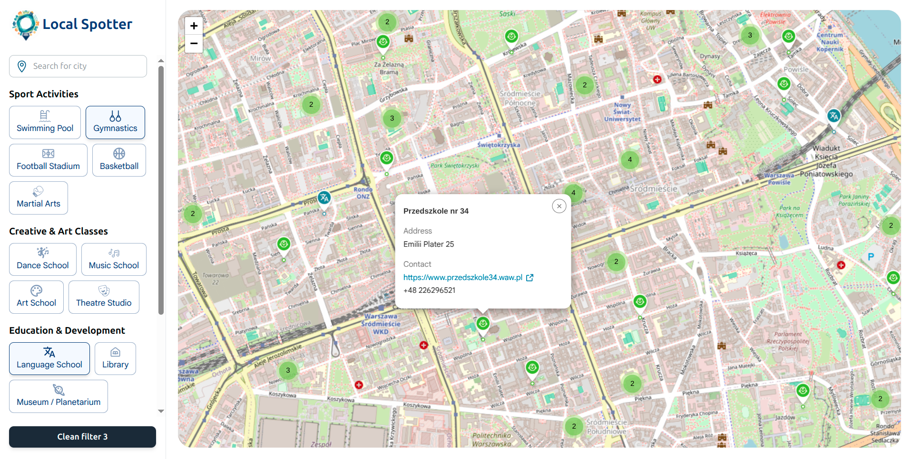
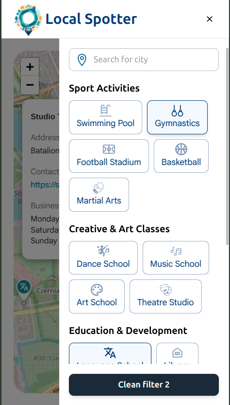

# 🗺️ Local Spotter
 
> Find sports clubs, art schools, libraries and more on an interactive map.
> Built for parents who want to explore what a neighbourhood has to offer their kids.
 
**[Current version (Poland) - dedicated API, PostGIS, and cached data → Live Demo](https://y-v-h.github.io/)**

**[Initial MVP (Belarus) - direct requests to public OSM mirrors → Live Demo](https://y-v-h.github.io/by)**
 

 
---
 
## 🚀 What it does
 
Local Spotter is a map-based application designed to help people explore neighborhoods and discover nearby places such as sports facilities, schools, libraries, parks, and coworking spaces.
 
Key features:
- **20+ categories** across Sport, Creative, Education and Infrastructure
- **Click on any marker** to see address, phone, website and wheelchair accessibility
- **Cluster view** - automatically groups markers at lower zoom levels
- **Multi-config build** - the project supports multiple regional deployments 
  via separate build scripts (`npm run build:pl` / `npm run build:by`). 
  Demo links for both versions are above.
- **Own API** - normalized POI data served from a dedicated backend; Overpass calls and mirror fallback are handled server-side, so the user sees neither latency spikes nor mirror errors
- **Responsive** - works on desktop and mobile
---
 
## 🛠️ Tech Stack
 
| Layer | Technology |
|---|---|
| Framework | React + TypeScript |
| Style | Tailwind CSS |
| State management | Zustand |
| Map | Leaflet + OpenStreetMap |
| Geocoding | Photon |
| Clustering | Leaflet.markercluster |
| Data source | Overpass API (OSM) |
| Caching | LocalStorage (geocoding) / Zustand (map nodes) |
| Component library | Custom (no UI library) |
| Component docs | Storybook |
| BE | NestJS + PostGIS |
 
---
 
## 🏗️ Architecture highlights
 

**Data flow:**

1. On first load, the map centers on the capital city by default
2. Users can start exploring immediately or search for another city within the currently selected country.
3. When a category filter is selected, a request is sent to the Local Spotter API, which returns normalized POI data for the selected category.
4. The API returns normalized data, which is then cached in Zustand for faster client-side interactions.
5. Successful Photon geocoding responses are cached in Zustand and stored in localStorage, allowing repeated searches to be served locally instead of querying the public Photon service again.
6. If the user switches cities, previous markers are removed from the map but **stay cached in the store**
7. Markers are **clustered** automatically based on zoom level
 
---
 
## 📱 Screenshots
 
| Desktop | Mobile |
|---|---|
|  |  |
 
---
 
## 🔮 Roadmap
 
- [x] Investigate faster alternatives to OSM mirror fallback
- [ ] Add neighborhood analysis features
---
 
## 📬 Contact
 
**[LinkedIn](https://linkedin.com/in/yahor-hurynovich/)** · **[GitHub](https://github.com/Y-V-H)**
